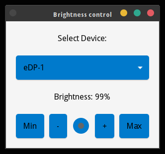

## Brightness Control Application

This is a simple brightness control application built with Python and GTK4. It allows users to adjust the brightness of their connected monitors using a graphical interface. The application detects connected displays, and users can select a display and adjust the brightness using a slider or predefined buttons.

### Features
- Select from multiple connected monitors.
- Adjust brightness using a vertical slider.
- Predefined buttons for setting brightness to minimum (20%) or maximum (100%).

### Prerequisites
- **Python 3.11+**
- **GTK 4.0+**
- The `gi` Python package (GObject Introspection).
- `xrandr` installed on your system (used for detecting monitors and adjusting brightness).

### Installation

1. Install the required packages:

   On Debian/Ubuntu-based systems:
   ```bash
   sudo apt install python3-gi python3-gi-cairo gir1.2-gtk-4.0 x11-xserver-utils
   ```

   On Fedora:
   ```bash
   sudo dnf install python3-gobject gtk4 xrandr
   ```

2. Clone the repository:
   ```bash
   git clone https://github.com/vimanuelt/brightness-control.git
   cd brightness-control
   ```

3. Run the application:
   ```bash
   ./brightness-control.py
   ```

### Usage
1. Upon starting the application, it will automatically detect connected monitors via `xrandr`.
2. Select a monitor from the dropdown list.
3. Use the slider to adjust the brightness, or click the buttons to quickly set the brightness to the minimum or maximum value.
4. The brightness level is displayed as a percentage.

### Screenshot


### Code Structure
- **`brightness.py`**: The main application code, containing the GUI and logic for detecting monitors and adjusting brightness.
- **CSS Styling**: The application uses embedded CSS for styling, located directly in the code.

### How It Works
1. **Monitor Detection**: The application runs the `xrandr` command to detect connected displays and their current brightness levels.
2. **Brightness Adjustment**: Brightness can be adjusted using the `xrandr` command, specifying the selected output and desired brightness level.

### License
This project is licensed under the BSD 3-Clause License. See the [LICENSE](LICENSE) file for details.

eel free to customize the repository name, screenshot, and any other sections according to your specific needs!
